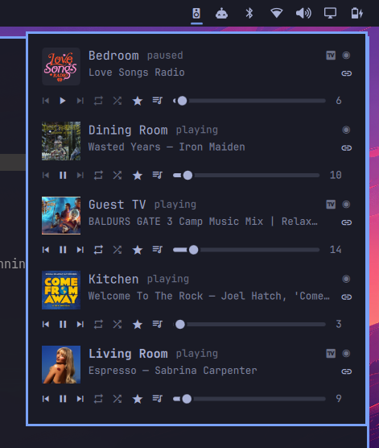

# x2rock

Local-first Sonos control for Linux, in Rust.

A CLI plus an MPRIS2 server, targeting [Omarchy](https://omarchy.org) 4.0 "Quattro" and its
Quickshell top bar. **No Sonos login required** — x2rock talks to speakers directly on the local
network.

The bar widget is Omarchy's. The CLI and the daemon are not: they carry no dependency on Omarchy,
Quickshell or Hyprland and run on any Linux — see [Other Linux
desktops](#other-linux-desktops).

**Every Sonos room becomes a standard MPRIS media player.** Your media keys, lock screen, GNOME and
KDE media applets, `playerctl`, and any bar's mpris widget play, pause, skip *and show what's
playing on Sonos* — track, artist and cover art — with no Sonos-specific setup. The bar widget is
one nice face on that; the desktop you already have is the other. See [MPRIS](#mpris).



> Status: complete for daily use. Rooms, volume — per room as well as per group — transport,
> favorites, the queue and its editing, grouping and party mode, soundbar TV input with the audio
> format it is actually receiving, all from the CLI, over MPRIS, or from the bar widget.
>
> Every one of those was exercised against real speakers rather than against the protocol
> documentation, which repeatedly turned out to be the only way to learn what is true: the
> undocumented facts that shaped the design are collected in
> [docs/architecture.md](docs/architecture.md).

## Why local-first

Sonos speakers expose the same JSON Control API on the LAN that Sonos's cloud exposes remotely,
over a WebSocket on port 1443, with no OAuth and no internet round-trip. It is the transport the
official Sonos mobile app itself has used since 2024. x2rock is built on it directly:

- **No account, no login, no cloud dependency** for normal use. Searching a music service does
  talk to that service, and only that; control never leaves the LAN.
- **Push events, not polling** — the LAN API supports real subscriptions.
- **One outbound connection**, which matters on Linux boxes with a default-deny firewall (Omarchy
  ships one) and on locked-down office networks.

Queue navigation uses UPnP/SOAP on port 1400, because the Control API — cloud or local — has no
view of the local Sonos queue.

## Install

Build it, install the binary, run the daemon. That much is the same on every Linux; the bar widget
is an extra step on Omarchy.

```sh
git clone https://github.com/rahga/x2rock
cd x2rock
cargo build --release
install -Dm755 target/release/x2rock ~/.local/bin/x2rock
```

Find the speakers next, once per network — every other command reconnects to what this remembers:

```sh
x2rock discover
x2rock rooms
```

If `rooms` lists your speakers, the CLI is done. Last, run the daemon as a user service, which is
what publishes each room as an MPRIS2 player:

```sh
mkdir -p ~/.config/systemd/user && cp systemd/x2rock.service ~/.config/systemd/user/
systemctl --user enable --now x2rock.service
```

Discover first, as above: the daemon connects only to players it has been told about, and will not
scan an unfamiliar network on its own. Doing it the other way round is not fatal, though — the
daemon re-reads the remembered players between reconnect attempts, so a `discover` that comes later
is picked up within a minute rather than needing a restart.

### On Omarchy

Arch's `rust` package tracks current stable, so `pacman -S rust` is enough if you would rather not
install rustup.

The bar widget is a Quickshell plugin, installed by copy:

```sh
cp -r quickshell/x2rock.sonos ~/.config/omarchy/plugins/
omarchy-shell shell rescanPlugins
omarchy plugin enable x2rock.sonos --section right
```

It needs `x2rock` on `PATH` (for the scroll gesture and favorites) and `x2rock daemon` running,
both of which the steps above did. If the pill does not appear, that is what to check —
`systemctl --user status x2rock`, then `x2rock rooms`. With no daemon there are no players, and the
widget hides itself rather than sitting there empty.

What it shows, and every key it reads from `shell.json`, is under [Omarchy bar
widget](#omarchy-bar-widget).

### On Ubuntu

Two things bite here, both quietly:

- **`apt`'s Rust is too old.** x2rock needs 1.88; no current Ubuntu packages it — 24.04 LTS is on
  1.75, and the interim releases are behind as well, so `apt install cargo` is a dead end rather
  than a maybe. Cargo at least refuses in one plain line naming the version it wants. Install a
  current toolchain from [rustup.rs](https://rustup.rs) and build again.
- **`~/.local/bin` may not be on `PATH` yet.** Ubuntu's `.profile` adds it only if it already
  exists when the shell starts, so the `install` above creates it too late for the session you ran
  it in. `x2rock` is then "not found", and the daemon and the service both fail with nothing
  obviously wrong. Log out and back in, or `export PATH="$HOME/.local/bin:$PATH"` for the session
  at hand.

There is no bar widget on Ubuntu — it is a Quickshell plugin and wants Omarchy. The daemon is not:
GNOME's and KDE's media controls, `playerctl`, Waybar and the desktop media keys all drive Sonos
through MPRIS, which is most of the widget's value. See [Other Linux
desktops](#other-linux-desktops).

## Usage

```sh
x2rock discover          # find players on this network and remember them
x2rock rooms             # rooms and their playback state
x2rock now               # what is playing
x2rock status            # every room: now-playing, volume, grouping, TV — one call
x2rock status --json     # the same, machine-readable (a bare array), for scripts and agents
x2rock status --json --full  # wrapped in a household envelope: which household/network, warnings
x2rock play | pause | toggle | next | prev
x2rock vol               # show volume  (--json for {room, volume, muted, fixed})
x2rock vol 30            # set it
x2rock vol +5            # nudge it
x2rock vol mute | unmute
x2rock vol 30 --player   # this room's own speaker, not the group it plays with
x2rock --all vol -10     # every room at once (per-room commands only)
x2rock repeat            # show repeat mode  (--json for {room, repeat})
x2rock repeat all | one | off
x2rock shuffle on | off  # --json for {room, shuffle}; bare `shuffle` shows it
x2rock queue             # the queue, current track marked
x2rock play 4            # play the 4th track in the queue
x2rock queue remove 4    # drop a track, or a range: remove 4-8
x2rock queue move 4 1    # move a track to another position
x2rock queue save "Tonight"   # save the queue as a Sonos playlist
x2rock queue clear --yes # empty it; Sonos keeps no undo
x2rock queue sources     # saved playlists and favorites, and which can be added
x2rock queue add "Bedtime" [--next]   # append a saved playlist
x2rock favorites         # saved favorites
x2rock favorites bedtime # only those matching
x2rock favorite "80s Flash"   # play one, by name or id
x2rock -r "Living Room" group Kitchen   # Kitchen joins Living Room, playing what it plays
x2rock ungroup Kitchen   # Kitchen leaves, on its own again
x2rock -r "Living Room" tv   # switch a soundbar to its TV input
x2rock -r Kitchen party  # party mode: every room joins Kitchen
x2rock party off         # break it up, every room on its own
x2rock daemon            # every room as an MPRIS2 player, until stopped
```

`-r`/`--room` is repeatable for the per-room commands — `vol`, `repeat`, `shuffle`, and transport
(`play`/`pause`/`toggle`/`next`/`prev`). `x2rock -r Kitchen -r Bedroom vol 10` applies to each with
the topology resolved once, printing one line per room; it is aimed at agents driving several rooms
without a process per room. Commands that are not per-room (or take a single target) reject several
`--room` rather than silently acting on the first, and a fan-out that hits an error stops there and
names the room.

`group` adds rooms to `--room`'s group; name as many as you like. `ungroup` takes its room
positionally and needs no `--room`, since a room is only ever in one group. Both print the group as
it ended up, so the result is visible rather than merely claimed. A room that joins a group plays
what that group plays; when it leaves, its own queue is still there but it comes back stopped at
the first track rather than where it was.

`now` on a soundbar shows what the TV is actually sending — `TV Audio  [Dolby Digital Surround
5.1]`, or `[Dolby Digital 2.0]` when the source has quietly fallen back to stereo, which is
otherwise invisible. `tv` switches a soundbar to its TV input; rooms without one say so rather
than trying.

`party` is `group` with every other room named for you — the classic Sonos party mode, hosted by
whichever room you point it at.

`favorite` is the one command that can start a room from nothing: `play` only resumes, so a room
with an empty queue has nothing for it to do. A query matches an id exactly or a name
case-insensitively, and several matches are reported rather than guessed between — except when one
of them is the whole name, so `favorite Bedtime` is not made ambiguous by "Bedtime P5 Mix". Loading
a favorite replaces what the room had queued, which is what Sonos itself does.

With one group in the household no room needs naming. Otherwise pass `-r "Media Room"` or set
`X2ROCK_ROOM`. `rooms --json`, `now --json` and `favorites --json` emit a flat schema meant for
bar widgets.

Discovery is explicit. `x2rock discover` sweeps the local subnet once and remembers what it finds
per network (keyed by gateway, in `~/.local/state/x2rock/networks.json`); every other command
just reconnects to what was remembered. On a network x2rock has never seen it refuses to scan on
its own — a laptop should not probe hotel or client WiFi unasked — and tells you to run
`discover`. On a known network where the remembered players have moved, it rescans once.

### Errors, for agents

A command that failed with `--json` reports the failure as JSON on stderr and exits non-zero, so a
caller reads a field instead of parsing a sentence:

```json
{"code":"unregistered_network","error":"unregistered network (gateway …): … `x2rock discover` will scan this network — offer it, do not auto-run …","fix":null}
```

`code` is a stable identifier for the *kind* of failure — `unregistered_network` (fix **null**: the
machine is on a network with no known speakers, normal away from home; `x2rock discover` is *offered*,
never auto-run, since it scans the local network), `unknown_room` (`x2rock rooms`), `needs_link`
(`x2rock link <service>`), `no_player` (`x2rock discover`), `too_many_rooms` (several `-r` on a
single-room command) — `error`
is the same human message the plain CLI prints, and `fix` is the command that resolves it, verbatim,
when there is one. An error with no known remedy is still structured — `{"code":"unknown", …,
"fix":null}` (the code `unknown`, so it never collides with the `error` message field). Some codes carry extra detail: `unknown_room` includes `did_you_mean` (typo-tolerant
suggestions) and `rooms` (the full list), so a mistyped `-r` is fixable from the one reply. Without
`--json` the message prints as prose exactly as before.

### The agent skill

`x2rock skill` installs a [Claude](https://claude.com/claude-code) skill that teaches an AI
assistant on this machine to drive the CLI — the `status --json` snapshot, the error `code`/`fix`
contract above, and the command surface:

```sh
x2rock skill              # → ~/.claude/skills/x2rock/ (or $CLAUDE_CONFIG_DIR/skills/)
x2rock skill --dir path   # write somewhere else, e.g. a project's .claude/skills
x2rock skill --print      # emit it to stdout — to inspect, or to seed a non-Claude agent
```

The skill is embedded in the binary, so it always matches the CLI it documents; re-run after an
upgrade to refresh it. With it installed, asking Claude to control Sonos loads x2rock's usage
automatically.

## MPRIS

This is the feature most of the rest rides on: **x2rock makes Sonos a first-class citizen of the
Linux media ecosystem.** Anything that already speaks MPRIS controls Sonos and shows its
now-playing with no further setup — Omarchy's built-in `omarchy.media` bar widget (`omarchy plugin
enable omarchy.media`), Waybar's `mpris` module, `playerctl`, GNOME and KDE media applets, the lock
screen, and the keyboard's own media keys.

`x2rock daemon` publishes each group as `org.mpris.MediaPlayer2.x2rock-<room>` — "Media Room"
becomes `x2rock-media-room` — with full metadata, so the current track, artist and cover art
appear wherever your desktop already shows what is playing:

```sh
playerctl -p x2rock-media-room play-pause
playerctl -p x2rock-media-room metadata     # title, artist, cover-art URL
playerctl -p x2rock-media-room next
```

The daemon is the product here; the bar widget is one consumer of it, and so is every surface
above. That is also why the CLI and daemon carry no desktop dependency — see [Other Linux
desktops](#other-linux-desktops).

State comes from the player's own push events, not polling. The daemon keeps one WebSocket per
group coordinator, pings them to survive firewall idle timeouts, and reconnects with backoff.
logind says when the machine wakes and NetworkManager says when it lands on a network, so sockets
that did not survive a suspend or a move are replaced within seconds rather than waiting out the
keepalive's silence timeout. Only arriving counts: losing the network is left alone, because there
is nothing to reconnect to until one comes back. When no player is reachable — the normal case for
a laptop away from home — it backs off quietly and republishes when one appears.

The daemon runs as a systemd user service; [Install](#install) sets that up.

## Omarchy bar widget

`quickshell/x2rock.sonos/` is a Quickshell bar widget for Omarchy Quattro that shows every Sonos
room with the piece nothing else on the bar has: **per-room volume**. (Omarchy's built-in
`omarchy.media` shows one active player and has no volume; `omarchy.audio` controls the laptop's
own output.)

- The bar pill is a speaker glyph, lit while the focused room is playing; **scroll it to change
  that room's volume** (relative, the way Sonos wants stateless controls). Middle-click toggles
  play/pause, click opens the popup, and hovering names the room and the track in a tooltip.
- The popup lists every room: now-playing, previous/play/pause/next, repeat (one button cycling
  off → all → one) and shuffle, and a volume slider. Repeat and shuffle are dimmed when the
  source cannot do them — a radio stream, say — the way previous and next are dimmed when the
  source cannot skip.
- A `󰌷` on each room row opens grouping: the rooms playing together, each with its **own volume
  slider**, and every other room a click away from joining. The popup's own slider stays the
  group's, so the two are not the same control wearing different hats.
- A `󰲹` on each room row opens that room's queue: click a track to jump to it, and the row
  under the cursor grows buttons to move it up or down or drop it. It re-reads when the daemon says
  the queue moved — the `x2rock:queueVersion` it publishes changes however the queue changed,
  including from the Sonos app — so the view stays right without polling.
- A `◉` on each room row starts party mode **hosted by that room**: everyone joins it and
  plays what it plays. Once everyone is in there is only one row left, and its button ends the
  party. Hidden in a one-speaker household. Grouped rooms list their members under the room name.
- A `󰓎` on each room row opens that room's favorites, so picking something to play never means
  picking a room as well. **Type to filter** by name or service, `↑`/`↓` and `Enter` to choose,
  `Esc` to close; the mouse works throughout. This is a separate panel rather than part of the
  popup, because a bar popup cannot take keyboard focus — which is also why opening it closes the
  room list.
- Cover art appears beside each room and each favorite. Sonos serves most of it from the speaker
  itself (`http://<player>:1400/getaa?...`, no account and no internet); the rest comes from the
  music service's own CDN, and some sources have none, so a missing cover falls back to a themed
  glyph rather than a hole. Deliberately **not** on the bar pill: that is always on screen, and a
  full-colour thumbnail there would fight whatever palette the bar is themed to. Set
  `"art": false` on the widget's `shell.json` entry to drop it from the popup too.
- Every glyph, the cover size, and the state and members lines are set from that same `shell.json`
  entry — the widget installs by copy, so editing its QML does not survive an update, and
  `shell.json` does. `quickshell/x2rock.sonos/README.md` documents every key, and is installed
  alongside the widget so it is there to read wherever the plugin ends up.
- Display is entirely event-driven off the x2rock daemon's MPRIS players — the widget never polls.
  No daemon, no players, and the widget hides itself. The picker is the exception, because MPRIS
  carries none of what it lists: favorites, kept items and the linked-account list each come from
  the CLI (`favorites --json`, `bookmarks --json`, `accounts --json`), read when the picker is
  opened rather than on any timer.

Installing it is three commands, under [Install](#install) along with the binary and the daemon
it needs.

## Other Linux desktops

Omarchy Quattro is the target, and the bar widget needs it — it is a Quickshell plugin. Nothing
else here does. `grep -ri omarchy src/` finds nothing; the CLI and the daemon are ordinary Linux
programs and are useful on their own.

On any Linux with systemd and a session D-Bus:

- **The CLI works unchanged.** Discovery reads the interface netmask and `/proc/net/arp`; the queue
  is UPnP over plain HTTP; everything else is the Sonos LAN WebSocket.
- **`x2rock daemon` publishes every room as an MPRIS2 player**, which is a desktop-agnostic
  interface — `playerctl`, Waybar's `mpris` module, GNOME's and KDE's media controls and desktop
  media keys all drive Sonos with no further setup. That is most of the widget's value without the
  widget.

Worth knowing before installing:

- **Rust 1.88 or newer** — often newer than the version a distribution packages, so `rustup` is
  the reliable route. [Install](#install) has the build; [Requirements](#requirements) has the why.
- **logind and NetworkManager are optional.** They are how the daemon learns it woke from suspend
  or landed on a different network. Without either it still recovers, just more slowly — the
  keepalive finds the dead socket instead — and says so once at startup: *"not watching for resume
  from suspend (...); a dead socket will be found by the keepalive instead"*. That line is expected
  on a machine without them, not a fault to chase.
- **The systemd unit assumes a graphical session.** `systemd/x2rock.service` is `WantedBy=
  graphical-session.target`, which never fires on a headless box. For a server, point it at
  `default.target` instead and enable lingering (`loginctl enable-linger $USER`) so the user
  manager runs without a login.
- **The queue commands need the Sonos UPnP setting enabled**, as they do everywhere.

## Queue

`x2rock queue` lists the queue with the current track marked; `x2rock play N` jumps to track N;
`remove`, `move`, `save` and `clear` change it. The queue is not reachable through the Control API
— cloud or local — so this goes over UPnP/SOAP on port 1400, which needs the Sonos UPnP setting
enabled.

Sonos versions the queue, and enforces it: a change sent against a version that has moved on is
refused outright rather than applied to the wrong tracks. So each change reads the current version
immediately before sending, and if someone edits the same queue from the Sonos app in that instant,
the change fails and says so instead of silently doing the wrong thing.

`clear` requires `--yes`, because Sonos keeps no undo for it. `save` first is a cheap insurance
policy: it costs nothing and turns any later mistake into two taps in the Sonos app.

`queue add` appends a saved Sonos playlist, or any favorite that is a single track. What it cannot
append is a station or a collection — an album, a playlist, a radio stream — because Sonos will only
play one of those *in place of* the queue rather than adding it. `queue sources` says which is which
in its third column, and `queue add` explains itself rather than passing on a bare UPnP error. To
play a station or collection, `x2rock favorite <name>` replaces the queue with it, which is what the
Sonos app does too.

## Non-goals

- Android (see [`x2rocktv`](https://github.com/rahga/x2rocktv) for the Kotlin/JVM Android TV app)
- Cloud OAuth / control from outside the LAN (deliberately cut; the transport seam remains)
- Sonos S1. Every supported device runs S2 (`<swGen>2</swGen>` in the player's device
  description); no S1 accommodation is carried anywhere in the code.
- Pre-Quattro Omarchy, Waybar-first design

## Searching a music service

```sh
x2rock search                                   # what can be searched here
x2rock search -s tunein                         # that service's categories
x2rock search -s tunein jazz                    # search it
x2rock search -s somafm --play 3 ambient        # play the third hit
```

This was a non-goal until it turned out not to need an account. A music service is linked to the
**household**, not to a Sonos login, and a speaker hands any controller on the LAN the service's
endpoint, manifest and search categories with no credential at all. About a third of the catalogue
— 32 of 108 services here, and most of the radio-shaped ones — declare anonymous access and can
then be searched outright. `--play` plays the hit: a live stream opens a playback session and leaves
the queue alone, while anything on-demand is added to the queue, because that is the only way the
player will resolve a service's own media. See "Browsing a service" for why both exist.

The rest need an account, and they split in two. **Fourteen offer device linking**, which x2rock
can drive — see below. The remaining sixty-two link through the service's own app rather than a
code — but that tier is not uniformly closed, because the hand-off is the controller's business
and not every service insists on it. `x2rock link` will ask any of them for a browser page and let
the service answer; **Plex** is linked through its own PIN flow and then searched and browsed like
anything else. For one that never answers, x2rock says so plainly rather than half-working:

```
$ x2rock search -s "YouTube Music" jazz
Error: YouTube Music needs a linked account, and offers no code flow x2rock can drive.
Some services in this tier answer with a browser page anyway: `x2rock link YouTube Music`
asks, and a refusal costs nothing.
```

YouTube Music is the closed case worth naming, because it is closed for a reason no amount of
work here will move: it wants an API key before it will discuss accounts at all, and the key Sonos
ships to its own clients is encrypted, openable only by the Sonos app and the player firmware.
There is no key to present — see *The YouTube Music `apiKey` is sealed* in
[docs/architecture.md](docs/architecture.md) for the bytes. Playing a YouTube Music track you
already know about is a different matter and works fine; see [Keeping things you cannot search
for](#keeping-things-you-cannot-search-for).

In the bar widget, the favorites picker searches too: type a term and a **Search TuneIn** row
appears under the filtered favorites; choosing it runs the query and the hits join the same list.
`searchService` in `shell.json` picks the service, and `""` turns it off entirely. A search that
fails leaves the rows already on screen alone and says so in one line — the CLI is blunt, the
widget is not.

**Talking to a music service is the only thing x2rock does that leaves the LAN, and it is confined
to the CLI** — `search`, `browse` and `link`, each in a subprocess of its own. The daemon speaks to
nothing but the local network, so a service being slow or unreachable cannot delay play, pause or
volume: a widget losing search or browse keeps every control it had. See
[docs/architecture.md](docs/architecture.md), "Rule: talking to a service never enters the daemon".

## Browsing a service

```sh
x2rock browse                                   # what can be browsed
x2rock browse -s iheartradio                    # the service's own root
x2rock browse -s iheartradio for_you            # open a container
x2rock browse -s iheartradio for_you --play 1   # play a row
```

The other half of `search`. A search takes a word; this takes a *place* — a
personal library, a "For You", a genre tree — and those are the parts of a
service no search term can name. "Play something from my playlists" is not a
search, and this is what answers it. Every service starts at `root`; a trailing
`/` marks a row you can open, and everything else is a row you can play.

It needs exactly what searching needs, so the same services are reachable: the
32 anonymous ones plus whatever is linked. `--json` adds one field to the shape
`favorites`, `search` and `bookmarks` already share — `container`, saying whether
a row is a place or a thing.

A caution worth repeating: **do not trust a service's `canPlay` flag.**
iHeartRadio marks an `artist_radio` collection playable, and handing its id to
the play path is refused with a grammar error. What decides is whether the item
arrived as a container, which is what `browse` reports.

In the bar widget, each of these services is a **Browse …** row in the picker.
Which services get one is discovered, not configured: `searchService`, then
every account this machine has linked — `x2rock link` already named the
services that matter, so the widget reads `x2rock accounts --json` instead of
asking for the same names twice. The anonymous services stay out of the
discovered list on purpose (nobody chose those 32), and `browseServices` in
`shell.json` still overrides it by hand: the only way an anonymous service
beyond `searchService` gets a row, and `[]` turns browsing off.

## Linking an account

```sh
x2rock link                                     # services that can be linked
x2rock link bandcamp                            # link one
x2rock accounts                                 # what is linked here
x2rock unlink bandcamp                          # forget the token
```

Fourteen services — Bandcamp, TIDAL, Deezer, Mixcloud, Sonos Radio, iHeartRadio and others — offer
**device linking**, and it is a better flow than an OAuth popup. `x2rock link bandcamp` opens the
service's own login page in whatever browser you already use, waits for you to finish, and stores
the token the service mints. No Sonos account, no partner registration, no embedded browser, and
nothing to bundle. Over ssh, `--no-open` prints the URL instead.

**Plex is the fifteenth**, and it earns a special case: its Sonos-side link calls are dead on the
server, but its search endpoint honours a plain Plex account token, and Plex publishes a PIN flow
that mints one for any client — the same flow every third-party Plex app uses. `x2rock link plex`
drives it; the login page carries the code, so signing in is the whole interaction. The token lands
on your Plex account's device list (as `x2rock-<hostname>`), where it can be revoked. One caveat on
a Plex server without Remote Access: that token searches and plays but cannot open Plex's *root* —
`x2rock link plex --from-player` stores the household integration's own token instead, read from
the art URLs your players already broadcast, which browses everything but dies whenever Plex is
relinked to Sonos. An app-link service other than Plex can also be *tried* — `x2rock link <name>`
asks it for a browser page, some services answer, and a refusal costs nothing.

The token is x2rock's own, not the household's — minted for this machine. `x2rock link` also
registers the account with your household so the speakers know about it, where the service hands
over the identifier that needs (`--no-match` skips it; Bandcamp does not send one).

**A caution learned the hard way.** Linking a service does not necessarily give you a catalogue to
search. Bandcamp's Sonos interface is *your own collection* — purchases, wishlist, followed
artists — so on a fresh account `x2rock search -s Bandcamp` correctly finds nothing, and looks
broken while working perfectly. Browsing a linked collection is what `x2rock browse` is for. Check
what a service actually exposes before assuming a link makes it searchable.

The token is stored in `~/.local/state/x2rock/credentials.json` at mode **0600** — its own file,
not mixed into anything else. It is deliberately not put in a keyring: that would encrypt it at
rest, and it would also put a locked or missing keyring between you and your music in a tool
expected to work over ssh and inside a bar widget's subprocess. `x2rock unlink` forgets the local
copy; revoking it properly is done from that service's own account page.

## Keeping things you cannot search for

Most app-link services stay unsearchable — YouTube Music, Spotify and Apple Music among them
(Plex used to be on this list, and is not any more; see "Linking an account"). But *replaying*
something needs no credential at all: the id is enough, and the player resolves the account it
already holds. Discovery and repetition are separate problems, and this closes the second one for
every service, linked or not:

```sh
x2rock keep                  # remember what is playing
x2rock keep "Friday mix"     # ...under a name of your own
x2rock bookmarks             # what has been kept
x2rock bookmark Bodies       # play it again
x2rock bookmark Bodies --next  # queue it after the current track
```

Start it once from the Sonos app, keep it, and it is on the bar from then on. This works for
YouTube Music, Spotify, Apple Music and everything else the household has linked — x2rock never
sees a token.

The credential the player resolves is the household's, so a kept item lives exactly as long as the
household's account for that service does. Disconnect the service in the Sonos app and the player
refuses the same id at the door (UPnP error 800, at enqueue) — and nothing in the kept item can
warn about it in advance. Re-add the service and the same kept item plays again, under whatever
account the household holds now: the id is durable, and the credential was never in the bookmark.

`--container` keeps the album, playlist or station rather than the single track. Kept items live in
`$XDG_STATE_HOME/x2rock/bookmarks.json`, on this machine rather than in the household.

The daemon also notes whatever plays, so you need not remember to press anything:

```sh
x2rock bookmarks --all       # kept items and recent history, newest first
```

Kept entries are marked `*`, sort first and never expire; the history keeps the last 50. Recording
it can never affect playback — the daemon logs any failure and carries on.

## Probing the API

`x2rock raw` sends one Control API command and prints the reply, header included:

```sh
x2rock raw musicServiceAccounts:1 subscribe --watch 8
x2rock raw playback:1 getPlaybackStatus --scope group
```

It exists because the API is wider than this CLI covers, and settling what a namespace answers
should not need a rebuild. A player-side refusal prints and still exits 0 — for a probe,
`ERROR_UNSUPPORTED_COMMAND` is the answer, not a failure. `--watch` holds the socket open
afterwards, which is the only way to read a `subscribe`: its reply is empty and the state turns up
as an event.

`--scope` picks the target key (`household`, `group`, `player`, `none`), and it is the flag a probe
usually gets wrong first: `playback:1` and `playbackMetadata:1` want `group`, `playerVolume:1` and
`homeTheater:1` want `player`, `favorites:1` and `groups:1` want `household`. The key travels in
the header, not the body, so putting `groupId` in `PARAMS` does nothing. Getting it wrong answers
`ERROR_MISSING_PARAMETERS` naming the key it wanted, which is the tell. `raw --help` carries the
full table and worked examples — it is written for whoever is driving this next, which is more
often an agent than a person.

Read the reply's `header.namespace` before believing a namespace is missing — the player
canonicalises some of them, and `musicService:1` answering as `musicServiceAccounts:1` is what a
`grep` for the wrong name would have hidden.

For the music-service side, which is SOAP rather than the Control API, `X2ROCK_DUMP_SMAPI=1` prints
every request and reply to stderr:

```sh
X2ROCK_DUMP_SMAPI=1 x2rock search -s bandcamp miles
```

The whole credentials header is replaced with `(credentials omitted)`, so the dump cannot leak a
token into a terminal or a log.

For the daemon, `X2ROCK_LOG_VERBOSE=1 x2rock daemon` turns off the status-log coalescing: every
retry logs, and the backoff ramp (`retrying in 1s`, `2s`, …) comes back. Without it the daemon logs
a state once and then stays quiet — repeating an unchanged line only once an hour — which is right
for a laptop that is away all day but hides exactly what you want while diagnosing a flaky
reconnect. A network switch always logs either way.

## Tested devices

Everything here was developed against these, on one household:

| Device | Firmware | Notes |
|---|---|---|
| Sonos Beam ×3 | 95.1-78010 | TV input and the HDMI audio format were verified on these |
| Sonos One SL | 95.1-78010 | the original test speaker |
| IKEA SYMFONISK Bookshelf | 86.7-77050 | a third-party Sonos player, behaving identically on markedly older firmware |

Reports from anything else are welcome — open an issue. Two would be especially
useful, because they are the places the code is written for a case it has never
actually met:

- **An Arc, Arc Ultra, or anything doing Atmos.** The audio-format display
  handles height channels and would show `5.1.2`, but no speaker here has ever
  reported a height channel, so that path is untried. A soundbar that does is
  the one report that would confirm it.
- **A Port or an Amp**, which have real analog line-in. `playback:1 loadLineIn`
  refuses a Beam outright — "player does not have line-in" — so switching input
  goes over UPnP instead. On a Port or Amp that Control API command presumably
  does work, which would be worth knowing before anyone else designs around the
  refusal.

Era, Move, Roam, Sub, and the older Play:1/3/5, Playbar and Playbase are all
untested rather than known-bad; nothing in the design expects a particular
model.

**Sonos Ace headphones are not a target.** They are Bluetooth headphones rather
than players on the network, and everything here starts from a speaker with an
address to talk to.

## Requirements

- Linux, and a Sonos **S2** speaker on the same network. S1 is not supported.
- **Rust 1.88 or newer** to build it (`edition = "2024"`, and let-chains). This is declared as
  `rust-version` in `Cargo.toml`, so an older toolchain is refused by Cargo with a plain message
  naming the version it wants rather than a page of syntax errors. Distribution packages are often
  behind; `rustup` is the reliable route. Nothing here chases the newest thing for its own sake —
  it is simply not held back either.
- For the queue commands (`x2rock queue`, `x2rock play N`): the Sonos **UPnP** setting enabled
  (Sonos app → Settings → Privacy & Security → UPnP). Playback control needs nothing.

### Firewall note

x2rock needs no inbound connections and works unchanged behind a default-deny firewall, which is
what Omarchy ships. That is also why it does not use SSDP or mDNS to find speakers: a default-deny
inbound policy silently drops multicast replies, so discovery would find nothing and give no error.
Instead, `x2rock discover` probes the local subnet over outbound TCP, and results are remembered
per network.

## Design

The reasoning behind every choice here — why the local WebSocket over the cloud API, how discovery
copes with a default-deny firewall, the protocol facts verified against real hardware — is in
[docs/architecture.md](docs/architecture.md).

## Credits

Informed by prior reverse-engineering of the Sonos protocols by the community, in particular:

- [`sonos-websocket`](https://github.com/jjlawren/sonos-websocket) by jjlawren, whose
  handshake was the concrete reference for connecting to the LAN API.
- [Stephan van Rooij's Sonos API documentation](https://sonos.svrooij.io/) for the UPnP side.

## Licence

[0BSD](LICENSE) — public-domain-equivalent. Use it for anything, no attribution required.

That extends to packaging: nobody needs to ask. The only build constraint is the Rust version
above, and there is nothing else unusual — no build scripts, no vendored code, no network access at
build time beyond fetching crates.
